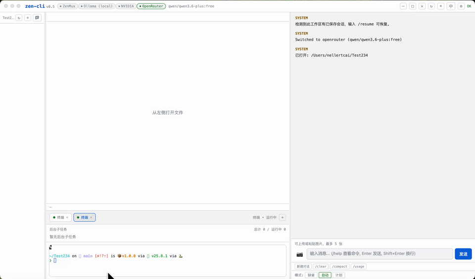

# ZenCLI

[English](#english) | [中文](#chinese)

### 运行展示 / Demo Showcase



<a id="chinese"></a>
## 🇨🇳 中文说明

ZenCLI 是一款强大的桌面端智能编程助手（基于 Electron 构建），旨在为用户提供无缝的 AI 交互开发体验。

> 🎁 **支持作者 & 推荐**  
> 本项目内置了 ZenMux 的高性能路由，点击此链接（[https://zenmux.ai/invite/GBQMC5](https://zenmux.ai/invite/GBQMC5)）注册可得 **5% 充值奖励**，同时也是对作者开源工作的支持。

### 特性
- 基于 Electron 打造跨平台桌面应用
- 现代化交互界面与终端、模型无缝集成体验
- 内置对 ZenMux 服务的高性能接入与转发支持
- 便捷的环境变量和配置管理

### 安装与运行指南

**前置依赖**：请确保您的电脑上已经安装了 Node.js (建议版本 >= 22.x)。

1. **安装依赖**
   ```bash
   npm install
   ```
2. **运行开发环境**
   如果您想启动命令行与 Web UI 模式，请运行：
   ```bash
   npm run dev
   ```
   如果您想启动独立的 Electron 桌面客户端版本，请运行：
   ```bash
   npm run electron:dev
   ```

### 构建与分发打包

当您准备好编译或分发项目供其他独立用户安装时，请使用以下打包命令：

- **编译为 Mac 应用程序 (.app)**
  ```bash
  npm run electron:build:mac
  ```
- **打包为 Mac 可直接分发的安装镜像 (.dmg)**
  ```bash
  npm run electron:build:mac:dmg
  ```
- **编译打包为 Windows 安装包与免安装绿色版 (.exe)**
  ```bash
  npm run electron:build
  ```
> 💡 构建完成的独立成品安装文件均会被自动放置在项目根目录下的 `release/` 文件夹中，您可以将其分发给任何人使用。

---

<a id="english"></a>
## 🇬🇧 English Description

ZenCLI is a powerful desktop AI coding assistant built on Electron, designed to provide a seamless interactive development experience.

> 🎁 **Support the Author & Recommendation**  
> This project features built-in high-performance routing powered by ZenMux. Create an account via this link ([https://zenmux.ai/invite/GBQMC5](https://zenmux.ai/invite/GBQMC5)) to receive a **5% top-up bonus**. This also helps to support the author's ongoing open-source development.

### Features
- Cross-platform desktop application powered by Electron
- Modern interactive interface with seamless terminal and AI model integration
- Built-in high-performance routing support for ZenMux services
- Easy management of environment variables and configurations

### Quick Start & Installation

**Prerequisites**: Please ensure you have Node.js (>= 22.x recommended) installed.

1. **Install dependencies**
   ```bash
   npm install
   ```
2. **Run in development mode**
   To start the CLI / Web UI mode:
   ```bash
   npm run dev
   ```
   To start the full Electron desktop app:
   ```bash
   npm run electron:dev
   ```

### Build & Distribution

When you are ready to compile and package the application for release and distribution:

- **Compile for macOS (.app)**
  ```bash
  npm run electron:build:mac
  ```
- **Build DMG Installer Pack for macOS**
  ```bash
  npm run electron:build:mac:dmg
  ```
- **Build Full Installer & Portable Versions for Windows (.exe)**
  ```bash
  npm run electron:build
  ```
> 💡 All compiled executables and distribution packages will be outputted to the `release/` directory in the root folder automatically.
